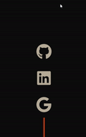

### Introduction
The main attractive functionality of these widget is that they are magnetic and basically follow the mouse pointer when it moves on the button area and when the mouse leaves the button area it will reset the button transform styles to zero.


### Installation
```terminal
flutter pub add magnetic
```

### Import
```dart
import 'package:magnetic/magnetic.dart';
```

### Examples
To create a magnetic widget just implement the MagneticWidget and assign a duration and a child
```dart
MagneticWidget(
  duration: const Duration(milliseconds: 200),
  curve: Curves.decelerate,
  child: Icon(Icons.thumb_up),
),
```


### 🐞 Bugs/Requests
If you encounter any problems please open an issue. If you feel the library is missing a feature, please raise a ticket on Github and we'll look into it. Pull request are welcome.
